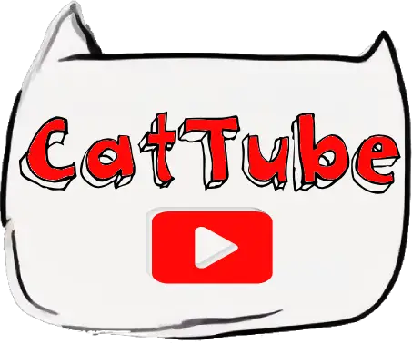

  

# Headless Cattube

Welcome to the repository for Headless Cattube, a demonstration project showcasing how to build a headless CMS using Wagtail with a static site generation (SSG) frontend using Next.js.

## Overview

This project is split into two main parts:
- **Backend**: A Wagtail CMS that serves as the headless backend.
- **Frontend**: A Next.js application that statically generates pages using data from the Wagtail backend.

## Deployment

- The **frontend** is deployed on Netlify.
- The **backend** is deployed on Google App Engine.

## Getting Started

To get started with this project, you'll need to set up both the frontend and the backend. Detailed instructions are available in their respective directories:

- [Frontend README](frontend/README.md)
- [Backend README](backend/README.md)

## Contributing

Contributions are welcome! Please refer to the READMEs in the frontend and backend directories for more detailed information on how to set up your development environment and contribute.

## License

This project is licensed under the MIT License - see the [LICENSE](LICENSE) file for details.